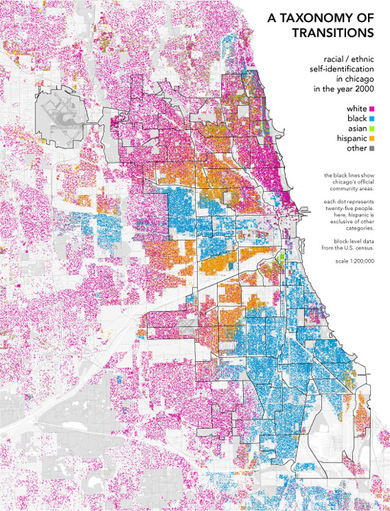

<style type="text/css">

body, td {
   font-size: 18px;
}
code.r{
  font-size: 18px;
}
pre {
  font-size: 18px
}

.showopt {
  background-color: #004c93;
  color: #FFFFFF; 
  width: 100px;
  height: 20px;
  text-align: center;
  vertical-align: middle !important;
  float: right;
  font-family: sans-serif;
  border-radius: 8px;
}

.showopt:hover {
    background-color: #dfe4f2;
    color: #004c93;
}

pre.plot {
  background-color: white !important;
}
</style>

<!-- script type="text/x-mathjax-config">
MathJax.Hub.Config({
  TeX: { equationNumbers: { autoNumber: "all" } }
});
</script -->

<script src="hideOutput.js"></script>

```{r setoptions, echo=FALSE}
knitr::opts_chunk$set(comment = NA)
```

[//]: require files: chicagodots_race_lines.jpg, segregation_r0t.RData, segregation_r0t4colors.RData, segregation2colors.RData, segregation4colors.RData, hideOutput.js

#Preface

In this write-up, I demonstrate the use of R to simulate the Schelling model of segregation. It was originally designed to demonstrate that the checking of invariants is a useful technique to test a code. However, the results are so interesting that I decide to write up the findings. This write-up was intended for the R course <a href="http://go.illinois.edu/stat390/" target="_blank">Stat 390EF</a> at the University of Illinois at Urbana-Champaign, but the coding is rather advanced for the introductory R course. So I decided not to make this a required reading.

#Introduction

The following map shows the distribution of people with different ethnicity living in the city of Chicago (source: <a href="http://www.radicalcartography.net/index.html?chicagodots" target="_blank">radicalcartography.net</a>):



It shows a clear racial segregation. Segregation may arise from social and economic reasons. However, Thomas Schelling, winner of the 2005 Nobel Memorial Prize in Economic Sciences, pointed out another possible reason. He constructed a simple model and used pennies and nickels on a graph paper to demonstrate that segregation can develop naturally even though each individual is moderately tolerant towards another group. For example, if everyone requires at least half of his neighbors to be of the same color, the final outcome is a high degree of segregation. What Schelling demonstrated was that the "macrobehavior" in a society may not reflect the "micromotives" of its individual members.

Schelling's model is an example of an agent-based model for simulating the actions and interactions of autonomous agents (both individual or collective entities such as organizations or groups) on the overall system. Agent-based models are useful in simulating complex systems. An interesting phenomenon that can occur in a complex system is *emergence*, in which a structure or pattern arises in the system from the bottom up. As you will see, segregation is a result of emergence in the system described by the Schelling model. Members of each group do not consciously choose to live in a certain area, but the collective behavior of the individuals gives rise to segregation.

While playing with the Schelling model, I find that the degree of segregation can be increased tremendously by adding a new parameter to the Schelling model.

In this write-up, I will demonstrate how R can be used to simulate the Schelling model. You can even watch the development of segregation in animations. The focus is on the Schelling model itself instead of R commands. Each piece of code is explained briefly in the code comments. Readers who are not interested in the detail of the codes can skip them entirely and just read the simulation procedures and results. 

#Model Description

###Geometry

Use a rectangular grid of size nr&times;nc to represent houses in a city. Assume that there are g groups of agents living in the city. To visualize the distribution of the groups in the city, each group of agents are represented by a unique color on the rectangular grid just like the Chicago map. To be concrete, I first focus on the case g=2, which is the original model considered by Schelling. The case with g=4 is considered later. 

###Neighbors

Each agent living in the city has neighbors. They are defined by the agents living in the adjacent houses (Up, Bottom, Left, Right, Up-Left, Up-Right, Bottom-Left, Bottom-Right), as illustrated in the graph below as yellow regions. Agent A, who lives in the interior of the grid, has 8 neighbors. Agent B, who lives on a boundary, has 5 neighbors. Agent C, who lives at a corner, has 3 neighbors.

```{r, echo=FALSE, fig.height=4, fig.width=3.5}
char = c('C',rep('',17),'A',rep('',25),'B',rep('',5))
x = rep(1:7,7)+0.5
y = rep(1:7, each=7)+0.5
plot(x,y,pch=char,xlab="",ylab="", xaxt='n',yaxt='n',xlim=c(1.2,7.8),ylim=c(1.2,7.8))
xc = c(1,3,3,2,2,1,1)
yc = c(3,3,1,1,2,2,3)
polygon(xc,yc,col="yellow")
xa = c(4,4,7,7,5,5,6,6,7,7,4)
ya = c(2,5,5,4,4,3,3,4,4,2,2)
polygon(xa,ya,col="yellow")
xb = c(2,2,5,5,4,4,3,3,2)
yb = c(8,6,6,8,8,7,7,8,8)
polygon(xb,yb,col="yellow")
abline(v=1:8, h=1:8)
```

A certain number of houses are set aside as unoccupied and each agent is free to move to these houses. The two groups are represented on the map by red and blue colors. The unoccupied houses are represented on the map as white. The two groups might represent different races, religious reliefs, economic status, etc. 

###Example Configuration

Set nr=nc=50. So the city is represented by a 50&times;50 square grid and there are 2500 houses. Assume that 1% of the houses are unoccupied (i.e. 250 empty houses). Of the remaining 2250 houses, half of them are occupied by the red group and the other half by the blue group. The following is an example of a configuration showing the two groups on a 50&times;50 square grid. They are constructed by randomly assigning the two groups of agents on the grid.

<div class="fold s">
```{r,fig.height=8, fig.width=7.5}
nr <- 50
nc <- 50
x <- rep(1:nr,nc)+0.5
y <- rep(1:nc,each=nr)+0.5
n_white <- 250
n_red <- 1125
n_blue <- 1125
n_agent <- 2250
set.seed(8326454)
m <- matrix(sample(c(rep("white",n_white),rep("red",n_red),rep("blue",n_blue))), nrow=nr, ncol=nc)
plot(x,y, pch=16, col=as.character(m),xlab="",ylab="", xaxt='n',yaxt='n',xlim=c(2.8,nr-0.8),ylim=c(2.8,nc-0.8))
abline(v=1:(nc+1), h=1:(nr+1))
```
</div>

###Similarity Ratio and Threshold

For each agent living on the grid, define the *similarity ratio* $r_{\rm sim}$ as the ratio of neighbors of the same group as the agent:
$$r_{\rm sim}=\frac{n_{\rm sim}}{n_{\rm neighbor}}\ \ \mbox{ if } n_{\rm neighbor} \neq 0 , \ \ \ r_{\rm sim} =1 \ \ \mbox{ if } n_{\rm neighbor}=0$$
where $n_{\rm sim}$ is the number of neighbors of the same color as the agent, and $n_{\rm neighbor}$ is the total number of *occupied* houses in the agent's neighbors. The value of $r_{\rm sim}$ ranges between 0 and 1. If all houses in the agent's neighbors are unoccupied (i.e. $n_{\rm neighbor}=0$), define $r_{\rm sim}=1$. Also define the mean similarity ratio as the value of $r_{\rm sim}$ averaged over all agents.

The *similarity threshold*, $t$, is a parameter in Schelling's model. It takes a value between 0 and 1 and it measures how intolerant an agent is towards the other groups. An agent is satisfied if at least a fraction $t$ of his neighbors belong to the same group. That is to say, an agent is satisfied if his $r_{\rm sim} \geq t$, and is dissatisfied if his $r_{\rm sim} < t$. For simplicity, $t$ is assumed to be the same for all agents in the city. The larger the value of $t$, the more intolerant the agents are towards agents of other groups.

###Agent Behavior

If an agent is satisfied (i.e. its $r_{\rm sim} \geq t$), he will do nothing and stay put. If an agent is dissatisfied (i.e. his $r_{\rm sim}<t$), he will move to an unoccupied house. Each dissatisfied agent will be relocated one by one. Each agent will find a random empty house and check if the similarity ratio at this location reaches or exceeds $t$. If so, he will move to this location. If not, he will pick another random empty house until he finds one that satisfies the  requirement. In some case when the city is crowded (not too many unoccupied house) and/or the similarity threshold $t$ is large, it could happen that none of the empty houses satisfies the agent's requirement $r_{\rm sim} \geq t$. In those cases, the dissatisfied agent will be moved to an empty house with the maximum value of $r_{\rm sim}$. When all of the dissatisfied agents move to new locations, round 1 of relocation is finished. 

Note that when all the dissatisfied agents move to new locations, some previously satisfied agents may become dissatisfied because their similarity ratios change as agents moving in and out of their neighborhood. The process of relocation is then repeated many times until all agents are satisfied. When that happens, the system is said to reach an equilibrium configuration. As long as there are enough unoccupied houses in the city, an equilibrium exists and will be reached eventually. An interesting question is how the mean similarity ratio in the equilibrium configuration varies as a function of the threshold $t$.

###Introducing a New Parameter

In the original Schelling model described above, a satisfied agent will not move. In reality, however, people move for reasons other than neighborhood. I introduce a new parameter, $r$, that determines the fraction of satisfied agents who will also move. In each round, in addition to the dissatisfied agents, a fraction $f$ of the satisfied agents will be randomly selected to move to new locations, where $f$ is a random number between 0 and $r$. So in each round, up to a fraction $r$ of satisfied agents will also move to new locations. The criterion of selecting the new location for these satisfied agents is the same as the dissatisfied agents: pick a random empty house with similarity ratio $r_{\rm sim} \geq t$ or an empty house with the maximum $r_{\rm sim}$ if there is no empty house that satisfies the agent's requirement. 

Unlike the original Schelling model, the movement of agents can go on forever, which is the case in real life. You will see that a *dynamic equilibrium* can be reached in this case, where the mean similarity ratio fluctuates around some fixed number as the agents continue to move. Whereas in the original model, a *static equilibrium* is reached when all agents are satisfied and the movement stops.

The introduction of this new agent behavior increases the mobility of agents. You will see below that the result is striking: the degree of segregation increases tremendously when compared to the original Schelling model.

#Code Implementation

The following five functions are defined for simulating the Schelling model. Click <span style="background-color:#004c93; color:white;">Show Source</span> to see the code.

Update (2018-02-26): To make things simple, I created an R package containing all these functions. You can install the package using the following commands.
```{r, eval=FALSE}
if (!require(devtools)) {
  install.packages("devtools")
  require(devtools)
}
install_github("ytliu0/schelling")
```
After the installation, type `library(schelling)` and all the functions will be loaded to your workspace. You can use `?` followed by the function name to see the documenation. For example, `?initial_config`. 

If you are interested in learning how to create an R package, read <a href="https://hilaryparker.com/2014/04/29/writing-an-r-package-from-scratch/" target="_blank">this post</a>. 

###initial_config(nr, nc, f_white, g, fg, g_color)

*Purpose*: Set up the initial configuration by randomly assigning houses to agents.

*Input Parameters*

- `nr`, `nc`: set up a rectangular grid of size nr&times;nc.
- `f_white`: fraction of unoccupied houses
- `g`: number of groups
- `fg`: numeric vector of length `g` containing the relative ratios of each group; for example `fg` = c(1,2,1) means that there are equal number of agents in groups 1 and 3, and the number of agents in group 3 is twice of the number in group 1. 
- `g_color`: character vector of length `g` specifying the color representation of each group. For example, `g_color`=c("red","blue","green") means that group 1 agents are represented by red, group 2 agents by blue and group 3 agents by green. Note that unoccupied houses are represented by the color "white", so "white" should not be used to represent agents of any group.

*Output*: A list containing two elements named `house` and `rsim`. `house` is a nr&times;nc matrix storing the occupation information of the house at each grid point; `rsim` is a nr&times;nc matrix storing the similarity ratio at each grid point.

<div class="fold s">
```{r}
initial_config <- function(nr,nc,f_white, g,fg,g_color) {
  N <- nr*nc # total number of houses
  
  # renormalize fg: n_agent_in_group_g/n_agent
  fg <- fg/sum(fg)
  
  # calculate the number of empty houses and number of agents in each group;
  # round numbers to the nearest integer
  n_white <- round(N*f_white,0)
  n_agent <- N - n_white
  ng <- round(n_agent*fg,0)
  
  # recompute n_agent and n_white to account for rounding
  n_agent <- sum(ng)
  n_white <- N - n_agent
  
  # sanity check
  if (n_white < 2) {
    stop("Error in initial_config: too few empty houses! Please change the input parameters.")
  }
  if (any(ng < 2)) {
    print("Number of agents in each group:")
    names(ng) <- g_color
    print(ng)
    stop("Error in initial config: too few agents in at least one group. Please change the input parameters.")
  }

  # set up a matrix and randomly assign agents to the houses in the city
  empty <- rep("white",n_white)
  agents <- as.character(unlist(mapply(rep,g_color,ng)))
  m <- matrix(sample(c(empty,agents)), nrow=nr, ncol=nc)
  # Compute the similarity ratio
  r_sim <- matrix(NA, nrow=nr, ncol=nc)
  r_sim <- compute_rsim(m, r_sim, nr, nc)
  
  # output the initial configuration in a list
  list(house=m, rsim=r_sim)
}
```
</div>

###compute_rsim_1point(m, i,j, istart,iend, jstart,jend)

*Purpose*: Compute the similarity ratio at the grid point (i,j). 

*Input Parameters* 

- `m`: a matrix of size nr&times;nc storing the occupation information of the house at each grid point.
- `i`, `j`: the grid point (i,j) at which the similarity ratio is to be computed.
- `istart`, `iend`, `jstart`, `jend`: input parameters that specify the neighbors of (i,j): the neighbors are the grid points at (`istart:iend`, `jstart:jend`) excluding (i,j) and locations where m is "white" (empty houses). These parameters are determined by the values of `i`, `j`, `nr`, and `nc`. They are computed in the functions `compute_rsim()` and `relocate()` right before calling this function.

*Output*: numeric vector of length 1 returning the similarity ratio at point (i,j).

<div class="fold s">
```{r}
compute_rsim_1point <- function(m, i,j, istart,iend, jstart,jend) {
  if(m[i,j]=="white") {
    # (i,j) is an empty location, return 0
    return(0)
  }
  r_sim <- 1
  # convert m[istart:iend,jstart:jend] from a matrix to a character vector 
  # and then remove the empty houses
  neighbors <- as.character(m[istart:iend,jstart:jend])
  neighbors <- neighbors[neighbors != "white"]
  # n_neighbor: Number of neighbors, -1 is inserted to substract off the (i,j) location
  n_neighbor <- length(neighbors)-1
  # n_sim: number of neighbors who are like (i,j), -1 is inserted to substract off (i,j) 
  n_sim <- sum(neighbors==m[i,j])-1
  # If there is at least one neighbor, calculate the similarity ratio; 
  # otherwise return 1 
  if (n_neighbor != 0) {
    r_sim <- n_sim/n_neighbor
  } 
  r_sim
}
```
</div>

###compute_rsim(m, r_sim, nr, nc)

*Purpose*: Compute the similarity ratio at each grid point.

*Input Parameters* 

- `m`: a matrix of size nr&times;nc storing the occupation information of the house at each grid point.
- `r_sim`: a matrix of size nr&times;nc storing the old similarity ratios at each grid point.
- `nr`, `nc`: the rectangular grid size parameters.

*Output*: a matrix of size nr&times;nc storing the updated similarity ratios at each grid point.

<div class="fold s">
```{r}
compute_rsim <- function(m, r_sim, nr, nc) {
  # The max() and min() functions are called to take care of boundary and corner points
  for (i in 1:nr) {
    istart <- max(i-1,1)
    iend <- min(i+1,nr)
    for (j in 1:nc) {
      jstart <- max(j-1,1)
      jend <- min(j+1,nc)
      r_sim[i,j] <- compute_rsim_1point(m,i,j,istart,iend,jstart,jend)
    }
  }
  r_sim
}
```
</div>

###relocate(config,nr,nc,t,r)

*Purpose*: relocate agents to a random empty location with similarity ratio &ge; the similarity threshold `t`. If no empty locations satisfy the agent's requirement, move the agent to the empty location with the maximum value of $r_{\rm sim}$.

*Input Parameters*

- `config`: a list containing two elements named `house` and `rsim`. `config$house` is a nr&times;nc matrix storing the occupation information of the house at each grid point; `config$rsim` is a nr&times;nc matrix storing the similarity ratio at each grid point. This list may be taken directly from the output of the function `initial_config()` or the output of this function.
- `nr`, `nc`: the rectangular grid size parameters.
- `t`: the similarity threshold.
- `r`: parameter specifying the maximum fraction of satisfied agents to relocate.

*Output*: A list containing two elements named `house` and `rsim`, storing the updated information of `config` after the relocation of agents. 

<div class="fold s">
```{r}
relocate <- function(config,nr,nc,t,r) {
  m <- config$house
  r_sim <- config$rsim
  
  # reloc: indices of dissatisfied agents; it's a matrix with two columns
  reloc <- which( (r_sim < t) & (m != "white"), arr.ind=TRUE)
  
  # satisfied: indices of satisfied agents; it's a matrix with two columns
  satisfied <- which( (r_sim >= t) & (m != "white"), arr.ind=TRUE)
  n_satisfied <- nrow(satisfied)
  
  # randomly pick some (up to r*satisfied agents) satisfied agents to relocate
  n_reloc <- floor(n_satisfied*runif(1, 0,r)+0.5)
  if (n_reloc > 0) {
    reloc_satisfied <- satisfied[sample.int(n_satisfied, n_reloc),]
    reloc <- rbind(reloc, reloc_satisfied)
  }
  
  # randomly shuffle the agents to be relocatd
  n_reloc <- nrow(reloc)
  if (n_reloc > 1) {
    reloc <- reloc[sample.int(n_reloc),] 
  }
  
  # recloate agents
  for (k in 1:n_reloc) {
    
    if (n_reloc==0) {
      # no agents to relocate
      break
    }
    
    # (i,j) indices of the kth agent to be relocated
    i <- reloc[k,1]
    j <- reloc[k,2]
    
    # find the indices of all empty locations
    w <- which(m=="white", arr.ind=TRUE)
    nw = nrow(w)
    # Shuffle the order 
    w <- w[sample.int(nw),]
    
    # find an empty location to relocate the agent 
    rsim_new <- rep(NA, nw)
    for (ii in 1:nw) {
      # (i1,j1): index of an empty location
      i1 <- w[ii,1]
      j1 <- w[ii,2]
      
      # temporary relocate to this empty location and then calculate 
      # the similarity ratio there
      m[i1,j1] <- m[i,j]
      m[i,j] <- "white"
      istart <- max(i1-1,1)
      iend <- min(i1+1,nr)
      jstart <- max(j1-1,1)
      jend <- min(j1+1,nc)
      rsim_new[ii] <- compute_rsim_1point(m, i1,j1, istart,iend, jstart,jend)
      if (rsim_new[ii] >= t) {
        # rsim >=t at this location. Relocation sucessful! 
        # Move on to the next agent
        break
      }
      # Not a good location! Move back to the original location and try another empty spot
      m[i,j] <- m[i1,j1]
      m[i1,j1] <- "white"
      
      if (ii==nw) {
        # All the empty locations are bad! Move to the empty location 
        # with the maximum rsim_new
        ii2 <- which.max(rsim_new)
        i1 <- w[ii2,1]
        j1 <- w[ii2,2]
        m[i1,j1] <- m[i,j]
        m[i,j] <- "white"
      }
    }
  }
  
  # update r_sim 
  r_sim <- compute_rsim(m, r_sim, nr, nc)
  
  # output the updated m and r_sim in a list
  list(house=m, rsim=r_sim)
}
```
</div>

###update_config(initial,n_agent,nr,nc,t,r,max_iter=10000L,anim_step=20000L,sleep_time=0)

*Purpose*: Control the update of configuration and show animation.

*Input Parameters*

- `initial`: the list outputted by the function `initial_config()`.
- `n_agents`: total number of agents.
- `nr`, `nc`: the rectangular grid size parameters.
- `t`: the similarity threshold.
- `r`: parameter specifying the maximum fraction of satisfied agents to relocate.
- `max_iter`: maximum number of iterations (default is 10000). If the parameter `r`=0, the simulation will stop when a static equilibrium is reached.
- `anim_step`: parameter that controls the animation &mdash; show updated map every `anim_step` iterations (default is 20000).
- `sleep_time`: parameter that controls the animation &mdash; pause the execution for `sleep_time` seconds (default is 0, meaning no pause). This is useful in cases where the execution is too fast for the plots to update. 

*Output*: A list with 3 elements &mdash; `house`, `rsim` and `rsim_avg`. `house` is a nr&times;nc matrix storing the occupation of houses in the final configuration; `rsim` is a nr&times;nc matrix storing the similarity ratio in the final configuration; `rsim_avg` is a numeric vector storing the mean similarity ratio in each iteration; the first element corresponds to iteration 0, the mean similarity ratio of the initial configuration.

<div class="fold s">
```{r}
update_config <- function(initial,n_agent,nr,nc,t,r, max_iter=10000L, 
                   anim_step=20000L, sleep_time=0) {
  # calculate the mean similarity ratio
  rsim_avg <- sum(initial$rsim)/n_agent
  
  # set up the grid for plotting
  x <- rep(1:nr,nc)+0.5
  y <- rep(1:nc,each=nr)+0.5
  
  # start simulation
  round_k <- initial
  for (k in 1:max_iter) {
    round_k <- relocate(round_k,nr,nc,t,r)
    
    # append rsim_avg
    rsim_avg <- c(rsim_avg, sum(round_k$rsim)/n_agent)
    
    # If r=0, check if an equilibrium has been reached.
    if (r==0) {
      if (all(round_k$rsim[round_k$house != "white"] >= t)) {
        # No more dissatisfied agents. Stop the simulation.
        break
      }
    }
    
    # animation
    if (k %% anim_step==0) {
      plot(x,y, pch=16, col=as.character(round_k$house),xlab="",ylab="", xaxt='n',yaxt='n',
           xlim=c(2.8,nr-0.8),ylim=c(2.8,nc-0.8),
           main=substitute(paste("Iteration ",kk,": t = ",tt,", ",bar(r)[sim]," = ",rsimAvg),
           list(tt=t,kk=k, rsimAvg=sprintf("%0.4f",rsim_avg[k+1]))))
      abline(v=1:(nc+1), h=1:(nr+1))
      if (sleep_time > 0) {
        Sys.sleep(sleep_time) 
      }
    }
  }
  
  # output the last configuration in a list
  list(house=round_k$house, rsim=round_k$rsim, rsim_avg=rsim_avg)
}
```
</div>

#Code Test

Testing a code is especially important for a relatively complex code like the one here. Two types of tests have been performed. The first test is to check the invariants. The second test is to compare the code with another, independently written code.

###Checking Invariants

In this model, no agents move in and out of the city. As a result, the number of agents in each group remains unchanged. The number of unoccupied houses is also fixed. These are the invariants in the model. 

Checking invariants proved to be helpful for the code development. There was a bug in the `relocate()` function. This bug caused the violation of invariants in the numerical result. I was able to use this clue to quickly track down the bug and fixed the problem. 

With the bug removed, the code can now pass the invariant checks. Consider the following example with `g`=4 (four groups). First set up the initial configuration. Next call `update_config()` with 10 iterations and finally check the invariant quantities.

```{r}
### Check invariants ###
# define parameters
nr <- 50
nc <- 50
N <- nr*nc
f_white <- 0.1 # 10% of unoccupied houses
g <- 4   # 4 groups
fg <- c(1,2,3,4)  # number of agents in the 4 groups has ratios 1:2:3:4
g_color <- c("red","blue","green","gold")

# set up t and r
t <- 0.15
r <- 0.05

# set up initial configuration
set.seed(8326454)
initial <- initial_config(nr,nc,f_white, g,fg,g_color)

# Get the number of agents in each group
ng <- sapply(g_color,function(c) { sum(initial$house==c)})
names(ng) <- g_color
n_white <- sum(initial$house=="white")
n_agent <- N - n_white

# The invariant quantities in the initial configuration are...

# Number of agents in each group:
ng
# Number of unoccupied houses:
n_white

# Consistency check: these numbers should sum up to 50x50=2500
sum(ng) + n_white

# Run update_config() for 10 iterations
final <- update_config(initial,n_agent,nr,nc,t,r,10)

# Recalculate the invariant quantities
ng_final <- sapply(g_color,function(c) { sum(final$house==c)})
names(ng_final) <- g_color
n_white_final <- sum(final$house=="white")

# The invariant quantities in the final configuration are...

# Number of agents in each group:
ng_final
# Number of unoccupied houses:
n_white_final
```
As shown above, the code passes the invariant checks.

###Comparison With Another Code

<a href="https://www.binpress.com/tutorial/introduction-to-agentbased-models-an-implementation-of-schelling-model-in-python/144" target="_blank">This webpage</a> provides a Python code that simulates the Schelling model. They consider the original Schelling model (i.e. without the parameter $r$) and study the equilibrium configuration as a function of the similarity threshold $t$. Their code was written independently and was written in a different programming language. This makes the code comparison especially valuable.

Note that the two codes are not expected to produce the exact same numbers. This is because the simulations involve random numbers and the functions involving random numbers here are written in ways that are quite different from theirs. However, the two codes are expected to give the same statistical results.

The following code reproduces the plot of the mean similarity ratio of the equilibrium configuration versus the similarity threshold $t$, the last plot on <a href="https://www.binpress.com/tutorial/introduction-to-agentbased-models-an-implementation-of-schelling-model-in-python/144" target="_blank">this webpage</a>.
```{r, fig.height=6}
# Set up the parameters to reproduce the same setup as the other code
nr <- 50
nc <- 50
N <- nr*nc
f_white <- 0.3 # 30% of unoccupied houses
g <- 2   # 2 groups
fg <- c(1,1)  # equal number of agents in the two groups
g_color <- c("red","blue")
r <- 0  # the original Schelling model

# set up initial configuration
set.seed(8326454)
initial <- initial_config(nr,nc,f_white, g,fg,g_color)

# Get the number of agents in each group
ng <- sapply(g_color,function(c) { sum(initial$house==c)})
names(ng) <- g_color
n_white <- sum(initial$house=="white")
n_agent <- N - n_white

# Loop over the similarity threshold from 0 to 0.7 as in the other code
t <- c(0,0.1,0.2,0.3,0.4,0.5,0.6,0.7)
rsim_t <- NULL
for (i in seq_along(t)) {
  # Run update_config() with max_iter set to 500 as in the other code
  set.seed(2816783)
  final <- update_config(initial,n_agent,nr,nc,t[i],r,500) 
  # extract the mean similarity ratio of the final configuration,
  # which is the last element of final$rsim_avg
  rsim_t[i] <- with(final, rsim_avg[length(rsim_avg)])
}

# Plot rsim_t vs t
plot(t,rsim_t,xlab="Similarity Threshold",ylab="Mean Similarity Ratio",
     las=1,pch=16,xlim=c(0,1),ylim=c(0,1))
```

The plot above is very similar to the last plot on their website. The numbers are not the same. In addition to the random number issue, the treatment of moving the agents here is a little bit different from theirs. Here the dissatisfied agents are moved to random locations that satisfy the condition $r_{\rm sim} \geq t$. Whereas the Python code simply moves the dissatisfied agents to random empty locations without checking the condition $r_{\rm sim} \geq t$. The procedure of moving the dissatisfied agents is also a little different from the Python code. I have modified the R code here to use their method of moving the agents and find better agreement with their numerical results. The remaining deviations are small but statistically significant. Upon close examination of both codes, I discovered a mistake in the Python code. The mistake causes a slight change in the numerical results, but the general result is the same. The final mean similarity ratios are only changed by about 0.01. So the plot still looks the same as the one on their website.

After correcting the mistake in the Python code, I performed a total of 240 simulations from both the R and the Python code to compare the numerical values of the mean similarity ratios of the final configurations, and then perform a series of two-sample t-tests. The remaining deviations between the two codes are found not to be statistically significant. This is a strong indication that both codes produce essentially the same results. 

#Simulation Results

Several cases are studied below. In all cases, the parameter `f_white` is set to 0.1, meaning there are 10% of unoccupied houses in the city. The cases with `g`=2 (two groups) and `g`=4 (four groups) are studied. In all cases, the parameter `fg` is set up so that each group has the same number of agents. 

##Two Groups (`g`=2)

The two groups of agents are represented by the colors red and blue. 

###Static Equilibrium (r=0)

First consider the original Schelling model ($r=0$). After randomly assigning the agents to the grid, the dissatisfied agents are relocated until a static equilibrium is reached. The similarity threshold $t$ is varied between 0 to 0.9. Note that since each agent has at most 8 neighbors, the maximum possible value of the similarity ratio is 1 and the second maximum possible value of $r_{\rm sim}$ is 7/8 or 0.875. So setting $t>0.875$ is the same as demanding all of the agent's neighbors to be in the same group. 

In the following code, the equilibrium configurations for $t$=0, 0.1, 0.2, ..., 0.9 are computed by calling the `update_config()` function and the final configurations are stored in the list `final`. The mean similarity ratios of the final configuration, $\bar{r}_{\rm sim}$, are also computed for each $t$ and are stored in a numeric vector `rsim_t`. Depending on your computer speed, the code may take several minutes to run. 

```{r, eval=FALSE}
# Set up the parameters
nr <- 50
nc <- 50
N <- nr*nc
f_white <- 0.1 # 10% of unoccupied houses
g <- 2   # 2 groups
fg <- c(1,1)  # equal number of agents in the two groups
g_color <- c("red","blue")
r <- 0  # the original Schelling model

# set up initial configuration
set.seed(8326454)
initial <- initial_config(nr,nc,f_white, g,fg,g_color)

# Get the number of agents in each group
ng <- sapply(g_color,function(c) { sum(initial$house==c)})
names(ng) <- g_color
n_white <- sum(initial$house=="white")
n_agent <- N - n_white

# Loop over the similarity threshold from 0 to 0.9
t <- c(0,seq(0.05,0.9,0.05))
rsim_t <- NULL
final <- list()
for (i in seq_along(t)) {
  # Run update_config() with max_iter set to 500
  set.seed(2816783)
  final[[i]] <- update_config(initial,n_agent,nr,nc,t[i],r,500) 
  # extract the mean similarity ratio of the final configuration,
  # which is the last element of final[[i]]$rsim_avg
  rsim_t[i] <- with(final[[i]], rsim_avg[length(rsim_avg)])
}
```
```{r, echo=FALSE}
# Load the RData file containing initial, final and rsim_t
load("segregation_r0t2colors.RData")
t <- c(0,seq(0.05,0.9,0.05))
names(final) <- paste("t =",t)
```

The following is a plot of the mean similarity ratio of the final configuration $\bar{r}_{\rm sim}$ as a function of the similarity threshold $t$.
```{r, fig.height=6}
plot(t,rsim_t, pch=16,las=1, xlab="Similarity Threshold", 
     ylab="Mean Similarity Ratio", xlim=c(0,1),ylim=c(0,1))
```

This plot is very similar to the plot for the code test, in which `f_white` is set to 0.3 (30% of unoccupied houses).

The following shows a table of the final mean similarity ratio vs $t$.
```{r}
names(rsim_t) <- paste("t =",t)
rsim_t
```
Note that when $t=0$, the agents don't care who their neighbors are and so no one moves. Hence, the final configuration is the same as the initial configuration. The mean similarity ratio of the initial configuration is `rsim_t[1]` or `r round(rsim_t[1],2)`. The case for $t=0.05$ and $t=0.1$ are practically the same as the $t=0$ case. Since each agent can have at most 8 neighbors, the second lowest value of the similarity ratio for each agent is 1/8 or 0.125. Therefore, both $t=0.05$ and $t=0.1$ means the same thing: each agent wants at least one neighbor to be like him. The table shows that the values of $\bar{r}_{\rm sim}$ for $t=0.05$ and $t=0.1$ are exactly the same. This is expected because the command `set.seed(2816783)` is used before running `update_config()` in each case. 

The plot and table show that a relatively high degree of segregation occurs even for moderate values of $t$, consistent with Schelling's finding in the 1970s. For example, $\bar{r}_{\rm sim}=0.74$ for $t=0.3$. The total segregation ($\bar{r}_{\rm sim}=1$) occurs when $t \geq 0.85$.

The following plots show the final configuration for several values of $t$. 
```{r, fig.height=8, fig.width=7.5}
x <- rep(1:nr,nc)+0.5
y <- rep(1:nc,each=nr)+0.5
plot(x,y, pch=16, col=as.character(initial$house),xlab="",ylab="", xaxt='n',yaxt='n',xlim=c(2.8,nr-0.8),ylim=c(2.8,nc-0.8),main=substitute(paste("Initial Configuration: ",bar(r)[sim]," = ",rsim0), list(rsim0=round(rsim_t[1],2))) )
abline(v=1:(nc+1), h=1:(nr+1))

names(final) <- paste("t =",t)
plot(x,y, pch=16, col=as.character(final[["t = 0.3"]]$house),xlab="",ylab="", xaxt='n',yaxt='n',xlim=c(2.8,nr-0.8),ylim=c(2.8,nc-0.8),main=substitute(paste("t = 0.3, ",bar(r)[sim]," = ",rsim0), list(rsim0=round(rsim_t["t = 0.3"],2))) )
abline(v=1:(nc+1), h=1:(nr+1))

plot(x,y, pch=16, col=as.character(final[["t = 0.7"]]$house),xlab="",ylab="", xaxt='n',yaxt='n',xlim=c(2.8,nr-0.8),ylim=c(2.8,nc-0.8),main=substitute(paste("t = 0.7, ",bar(r)[sim]," = ",rsim0), list(rsim0=round(rsim_t["t = 0.7"],2))) )
abline(v=1:(nc+1), h=1:(nr+1))

plot(x,y, pch=16, col=as.character(final[["t = 0.85"]]$house),xlab="",ylab="", xaxt='n',yaxt='n',xlim=c(2.8,nr-0.8),ylim=c(2.8,nc-0.8),main=substitute(paste("t = 0.85, ",bar(r)[sim]," = ",rsim0), list(rsim0=round(rsim_t["t = 0.85"],2))) )
abline(v=1:(nc+1), h=1:(nr+1))
```

###Dynamic Equilibrium (r > 0)

Now consider the cases with $r=0.05$ and keep everything else the same. This means that up to 5% of satisfied agents also move in each iteration. Since there is no longer any static equilibrium, the maximum number of iteration is the actual number of iteration, which is set to 10,000. The simulations are run for various values of $t$ as in the previous cases. The code below is almost exactly the same as the previous one. Depending on your computer speed, it may take a couple of hours to run.
```{r, eval=FALSE}
# Set up the parameters
nr <- 50
nc <- 50
N <- nr*nc
f_white <- 0.1 # 10% of unoccupied houses
g <- 2   # 2 groups
fg <- c(1,1)  # equal number of agents in the two groups
g_color <- c("red","blue")
r <- 0.05 

# set up initial configuration
set.seed(8326454)
initial <- initial_config(nr,nc,f_white, g,fg,g_color)

# Get the number of agents in each group
ng <- sapply(g_color,function(c) { sum(initial$house==c)})
names(ng) <- g_color
n_white <- sum(initial$house=="white")
n_agent <- N - n_white

# Loop over the similarity threshold from 0 to 0.9
t <- c(0,seq(0.05,0.9,0.05))
final <- list()
for (i in seq_along(t)) {
  # Run update_config() with max_iter set to 10000 (the default value)
  set.seed(2816783)
  final[[i]] <- update_config(initial,n_agent,nr,nc,t[i],r) 
}
names(final) <- paste("t =",t)
```
```{r, echo=FALSE}
# Load the RData file containing initial, final and rsim_t
load("segregation2colors.RData")
names(final) <- paste("t =",t)
```
First look at the case $t=0.05$ and $t=0.1$. As explained above, these two cases are identical. The mean similarity ratio $\bar{r}_{\rm sim}$ in each iteration for $t=0.1$ is stored in the numeric vector `final[["t = 0.1"]]$rsim_avg`. The first element corresponds to iteration 0, the initial configuration. The following is a plot showing $\bar{r}_{\rm sim}$ versus iteration. 
```{r}
plot(0:10000,final[["t = 0.1"]]$rsim_avg, type='l', las=1,
     xlab="Iteration",ylab="Mean Similarity Ratio", 
     main="t = 0.1")
```

The plot shows that the system quickly relaxes to a dynamic equilibrium, in which $\bar{r}_{\rm sim}$ oscillates around 0.55. This value is only slightly larger than the static equilibrium value 0.50.

Next look at the case $t=0.15$. The following is a plot showing $\bar{r}_{\rm sim}$ versus iteration.
```{r}
plot(0:10000,final[["t = 0.15"]]$rsim_avg, type='l', las=1,
     xlab="Iteration",ylab="Mean Similarity Ratio", 
     main="t = 0.15")
```

The system relaxes to a dynamic equilibrium at later times. The striking result is the high value of $\bar{r}_{\rm max}$ compared to the previous value 0.56 when the static equilibrium is reached. It means that as agents are continuously moving, a much higher degree of segregation results even for this small value of $t$. 

The cases for $t>0.15$ show a similar feature as the $t=0.15$ case, only that $\bar{r}_{\rm sim}$ oscillates around values closer to 1. The following plots show the cases for $t=0.3$ and $t=0.5$.
```{r}
plot(0:10000,final[["t = 0.3"]]$rsim_avg, type='l', las=1,
     xlab="Iteration",ylab="Mean Similarity Ratio", 
     main="t = 0.3")

plot(0:10000,final[["t = 0.5"]]$rsim_avg, type='l', las=1,
     xlab="Iteration",ylab="Mean Similarity Ratio", 
     main="t = 0.5")
```

By looking at the plots for all values of $t$, it is found that a dynamic equilibrium is reached no latter than 7500 iterations. The value of $\bar{r}_{\rm sim}$ at the dynamic equilibrium is calculated by averaging $\bar{r}_{\rm sim}$ from 7500 iterations to the end of simulation. The following shows a plot and table of the equilibrium $\bar{r}_{\rm sim}$ versus $t$.
```{r}
rsim_t <- NULL
for (i in seq_along(t)) {
   rsim_t[i] <- mean(final[[i]]$rsim_avg[7501:10001])
}
names(rsim_t) <- paste("t =",t)
plot(t,rsim_t, pch=16,las=1, xlab="Similarity Threshold", 
     ylab="Mean Similarity Ratio", xlim=c(0,1),ylim=c(0,1))
rsim_t
```

The equilibrium value of $\bar{r}_{\rm sim}$ shows a sharp discontinuity as $t$ exceeds 0.125, when the interior agents demand at least 2 neighbors to be like them. We see that as agents continuous to move, their slight preference on their neighborhood requirement leads to the emergence of segregation. Once a region with a homogeneous group forms, it attracts more agents from the same group and repels agents from the the other group. The result is the emergence of segregation.

The following shows plots of the configuration at iteration 10,000 for $t=0.15$, $t=0.3$, $t=0.5$ and $t=0.85$.
```{r, fig.height=8, fig.width=7.5}
x <- rep(1:nr,nc)+0.5
y <- rep(1:nc,each=nr)+0.5

plot(x,y, pch=16, col=as.character(final[["t = 0.15"]]$house),xlab="",ylab="", xaxt='n',yaxt='n',xlim=c(2.8,nr-0.8),ylim=c(2.8,nc-0.8),main=substitute(paste("t = 0.15, ",bar(r)[sim]," = ",rsim0), list(rsim0=round(rsim_t["t = 0.15"],2))) )
abline(v=1:(nc+1), h=1:(nr+1))

plot(x,y, pch=16, col=as.character(final[["t = 0.3"]]$house),xlab="",ylab="", xaxt='n',yaxt='n',xlim=c(2.8,nr-0.8),ylim=c(2.8,nc-0.8),main=substitute(paste("t = 0.3, ",bar(r)[sim]," = ",rsim0), list(rsim0=round(rsim_t["t = 0.3"],2))) )
abline(v=1:(nc+1), h=1:(nr+1))

plot(x,y, pch=16, col=as.character(final[["t = 0.5"]]$house),xlab="",ylab="", xaxt='n',yaxt='n',xlim=c(2.8,nr-0.8),ylim=c(2.8,nc-0.8),main=substitute(paste("t = 0.5, ",bar(r)[sim]," = ",rsim0), list(rsim0=round(rsim_t["t = 0.5"],2))) )
abline(v=1:(nc+1), h=1:(nr+1))

plot(x,y, pch=16, col=as.character(final[["t = 0.85"]]$house),xlab="",ylab="", xaxt='n',yaxt='n',xlim=c(2.8,nr-0.8),ylim=c(2.8,nc-0.8),main=substitute(paste("t = 0.85, ",bar(r)[sim]," = ",rsim0), list(rsim0=round(rsim_t["t = 0.85"],2))) )
abline(v=1:(nc+1), h=1:(nr+1))
```

##Four Groups (g=4)

The same calculations are repeated for the four-group cases. The groups are represented by the colors red, blue, green and gold. The results are similar and are summarized below by several plots and tables analogous to the two-group cases.

###Static Equilibrium (r=0)

####Code

```{r, eval=FALSE}
# Set up the parameters
nr <- 50
nc <- 50
N <- nr*nc
f_white <- 0.1 # 10% of unoccupied houses
g <- 4   # 4 groups
fg <- c(1,1,1,1)  # equal number of agents in all 4 groups
g_color <- c("red","blue","green","gold")
r <- 0  # the original Schelling model

# set up initial configuration
set.seed(8326454)
initial <- initial_config(nr,nc,f_white, g,fg,g_color)

# Get the number of agents in each group
ng <- sapply(g_color,function(c) { sum(initial$house==c)})
names(ng) <- g_color
n_white <- sum(initial$house=="white")
n_agent <- N - n_white

# Loop over the similarity threshold from 0 to 0.9
t <- c(0,seq(0.05,0.9,0.05))
rsim_t <- NULL
final <- list()
for (i in seq_along(t)) {
  # Run update_config() with max_iter set to 500
  set.seed(2816783)
  final[[i]] <- update_config(initial,n_agent,nr,nc,t[i],r,500) 
  # extract the mean similarity ratio of the final configuration,
  # which is the last element of final[[i]]$rsim_avg
  rsim_t[i] <- with(final[[i]], rsim_avg[length(rsim_avg)])
}
names(final) <- paste("t =",t)
names(rsim_t) <- paste("t =",t)
```
```{r, echo=FALSE}
# Load the RData file containing initial, final and rsim_t
load("segregation_r0t4colors.RData")
names(final) <- paste("t =",t)
```

####Mean similarity ratio of the equilibrium configuration ~ $t$

```{r, fig.height=6}
plot(t,rsim_t, pch=16,las=1, xlab="Similarity Threshold", 
     ylab="Mean Similarity Ratio", xlim=c(0,1),ylim=c(0,1))
rsim_t
```

####Equilibuium configuration for $t$ = 0 (initial configuration), 0.3, 0.7 and 0.85.

```{r, fig.height=8, fig.width=7.5}
x <- rep(1:nr,nc)+0.5
y <- rep(1:nc,each=nr)+0.5
plot(x,y, pch=16, col=as.character(initial$house),xlab="",ylab="", xaxt='n',yaxt='n',xlim=c(2.8,nr-0.8),ylim=c(2.8,nc-0.8),main=substitute(paste("Initial Configuration: ",bar(r)[sim]," = ",rsim0), list(rsim0=round(rsim_t[1],2))) )
abline(v=1:(nc+1), h=1:(nr+1))

names(final) <- paste("t =",t)
plot(x,y, pch=16, col=as.character(final[["t = 0.3"]]$house),xlab="",ylab="", xaxt='n',yaxt='n',xlim=c(2.8,nr-0.8),ylim=c(2.8,nc-0.8),main=substitute(paste("t = 0.3, ",bar(r)[sim]," = ",rsim0), list(rsim0=round(rsim_t["t = 0.3"],2))) )
abline(v=1:(nc+1), h=1:(nr+1))

plot(x,y, pch=16, col=as.character(final[["t = 0.7"]]$house),xlab="",ylab="", xaxt='n',yaxt='n',xlim=c(2.8,nr-0.8),ylim=c(2.8,nc-0.8),main=substitute(paste("t = 0.7, ",bar(r)[sim]," = ",rsim0), list(rsim0=round(rsim_t["t = 0.7"],2))) )
abline(v=1:(nc+1), h=1:(nr+1))

plot(x,y, pch=16, col=as.character(final[["t = 0.85"]]$house),xlab="",ylab="", xaxt='n',yaxt='n',xlim=c(2.8,nr-0.8),ylim=c(2.8,nc-0.8),main=substitute(paste("t = 0.85, ",bar(r)[sim]," = ",rsim0), list(rsim0=round(rsim_t["t = 0.85"],2))) )
abline(v=1:(nc+1), h=1:(nr+1))
```

###Dynamic Equilibrium (r > 0)

####Code

```{r, eval=FALSE}
# Set up the parameters
nr <- 50
nc <- 50
N <- nr*nc
f_white <- 0.1 # 10% of unoccupied houses
g <- 4   # 4 groups
fg <- c(1,1,1,1)  # equal number of agents in all 4 groups
g_color <- c("red","blue","green","gold")
r <- 0.05 

# set up initial configuration
set.seed(8326454)
initial <- initial_config(nr,nc,f_white, g,fg,g_color)

# Get the number of agents in each group
ng <- sapply(g_color,function(c) { sum(initial$house==c)})
names(ng) <- g_color
n_white <- sum(initial$house=="white")
n_agent <- N - n_white

# Loop over the similarity threshold from 0 to 0.9
t <- c(0,seq(0.05,0.9,0.05))
final <- list()
for (i in seq_along(t)) {
  # Run update_config() with max_iter set to 10000 (the default value)
  set.seed(2816783)
  final[[i]] <- update_config(initial,n_agent,nr,nc,t[i],r) 
}
names(final) <- paste("t =",t)
```
```{r, echo=FALSE}
# Load the RData file containing initial, final and rsim_t
load("segregation4colors.RData")
names(final) <- paste("t =",t)
```

####Mean similarity ratio ~ iteration for $t$ = 0.1, 0.15, 0.3 and 0.5.

```{r}
plot(0:10000,final[["t = 0.1"]]$rsim_avg, type='l', las=1,
     xlab="Iteration",ylab="Mean Similarity Ratio", 
     main="t = 0.1")

plot(0:10000,final[["t = 0.15"]]$rsim_avg, type='l', las=1,
     xlab="Iteration",ylab="Mean Similarity Ratio", 
     main="t = 0.15")

plot(0:10000,final[["t = 0.3"]]$rsim_avg, type='l', las=1,
     xlab="Iteration",ylab="Mean Similarity Ratio", 
     main="t = 0.3")

plot(0:10000,final[["t = 0.5"]]$rsim_avg, type='l', las=1,
     xlab="Iteration",ylab="Mean Similarity Ratio", 
     main="t = 0.5")
```

####Equilibrium mean similarity ratio (averaged over the last 2500 iterations) ~ t.

```{r, fig.height=6}
rsim_t <- NULL
for (i in seq_along(t)) {
   rsim_t[i] <- mean(final[[i]]$rsim_avg[7501:10001])
}
names(rsim_t) <- paste("t =",t)
plot(t,rsim_t, pch=16,las=1, xlab="Similarity Threshold", 
     ylab="Mean Similarity Ratio", xlim=c(0,1),ylim=c(0,1))
rsim_t
```


####Final configuration (iteration 10,000) for $t$ = 0.15, 0.3, 0.6 and 0.85.

```{r, fig.height=8, fig.width=7.5}
x <- rep(1:nr,nc)+0.5
y <- rep(1:nc,each=nr)+0.5
names(final) <- paste("t =",t)
plot(x,y, pch=16, col=as.character(final[["t = 0.15"]]$house),xlab="",ylab="", xaxt='n',yaxt='n',xlim=c(2.8,nr-0.8),ylim=c(2.8,nc-0.8),main=substitute(paste("t = 0.15, ",bar(r)[sim]," = ",rsim0), list(rsim0=round(rsim_t["t = 0.15"],2))) )
abline(v=1:(nc+1), h=1:(nr+1))

names(final) <- paste("t =",t)
plot(x,y, pch=16, col=as.character(final[["t = 0.3"]]$house),xlab="",ylab="", xaxt='n',yaxt='n',xlim=c(2.8,nr-0.8),ylim=c(2.8,nc-0.8),main=substitute(paste("t = 0.3, ",bar(r)[sim]," = ",rsim0), list(rsim0=round(rsim_t["t = 0.3"],2))) )
abline(v=1:(nc+1), h=1:(nr+1))

plot(x,y, pch=16, col=as.character(final[["t = 0.6"]]$house),xlab="",ylab="", xaxt='n',yaxt='n',xlim=c(2.8,nr-0.8),ylim=c(2.8,nc-0.8),main=substitute(paste("t = 0.6, ",bar(r)[sim]," = ",rsim0), list(rsim0=round(rsim_t["t = 0.6"],2))) )
abline(v=1:(nc+1), h=1:(nr+1))

plot(x,y, pch=16, col=as.character(final[["t = 0.85"]]$house),xlab="",ylab="", xaxt='n',yaxt='n',xlim=c(2.8,nr-0.8),ylim=c(2.8,nc-0.8),main=substitute(paste("t = 0.85, ",bar(r)[sim]," = ",rsim0), list(rsim0=round(rsim_t["t = 0.85"],2))) )
abline(v=1:(nc+1), h=1:(nr+1))
```

#Animation

The nice thing about the code is that you can watch the development of segregation during the simulation. In R, there are packages you can download to create animations. However, I find that it is easier to introduce two parameters in the `update_config()` function to show a simple animation for this particular model. The two parameters are named `anim_step` and `sleep_time` in the `update_config()` function. 

The parameter `anim_step` tells the `update_config()` function to plot the configuration every `anim_step` iteration. I find that setting `anim_step` to 5 or 10 works well in my home computer. For example, the following code shows the animation for the case `g`=2, $t=0.15$ and $r=0.05$.
```{r, eval=FALSE}
# Set up the parameters
nr <- 50
nc <- 50
N <- nr*nc
f_white <- 0.1 # 10% of unoccupied houses
g <- 2   # 2 groups
fg <- c(1,1)  # equal number of agents in the two groups
g_color <- c("red","blue")
t <- 0.15
r <- 0.05 

# set up initial configuration
set.seed(8326454)
initial <- initial_config(nr,nc,f_white, g,fg,g_color)

# Get the number of agents in each group
ng <- sapply(g_color,function(c) { sum(initial$house==c)})
names(ng) <- g_color
n_white <- sum(initial$house=="white")
n_agent <- N - n_white

# Run update_config() with max_iter set to 10000 (the default value), set anim_step=10
set.seed(2816783)
final <- update_config(initial,n_agent,nr,nc,t,r, anim_step=10) 
```
I suggest running the code in RStudio. Adjust the size of the Plot panel of your R studio to make the plot display nicely there. Also adjust the parameter `anim_step` to control the frequency of the update of the map. If you set the value of `anim_step` too small (e.g. 1), R's graphics generation may not be able to keep up with the execution speed and you probably won't see anything. If you encounter this problem, either set a larger value of `anim_step` or use the parameter `sleep_time`, which tells R to pause the execution for `sleep_time` seconds. This allows time for R to generate the graphics. For example, if you replace the last line by the command 

`final <- update_config(initial,n_agent,nr,nc,t,r, anim_step=1,sleep_time=0.8)`

the plot will be updated every single iteration, but the execution will pause for 0.8 seconds after every iteration to allow time for the plot to be shown. This slows down the calculation and so is not recommended. Setting a larger value of `anim_step` is more desirable.

#Questions to Consider

Only a small set of parameters is explored in this write-up. The following is a incomplete list of questions one can consider. Some of the issues were explored in Schelling's 1971 paper (Schelling 1971, *Journal of Mathematical Sociology*, Vol. 1, pp. 143-186). 

- How do the results change with the parameter `f_white`?

- How do the results change with the parameter `r`?

- How do the results depend on the the grid geometry? What happens if the city is represented by a 80&times;20 grid?

- In all cases presented here, the number of agents in each group is equal. What happens if this is not the case? 

- The similarity threshold $t$ is assumed to be the same for each agent. What happens if agents in different groups have different values of $t$? What happens if even agents within each group have different values of $t$?

- In reality, people move in and out of a city. How do the results change if agents are allowed to move in and out of the city?

- What if people dislike the idea of living in a region with too many people like them? Introduce a new parameter $m$, which takes a value between $1-t$ and 1, and designate an agent to be dissatisfied if his $r_{\rm sim}<t$ and $r_{\rm sim}>m$. How will the results change?

<br />
<br />
<br />
